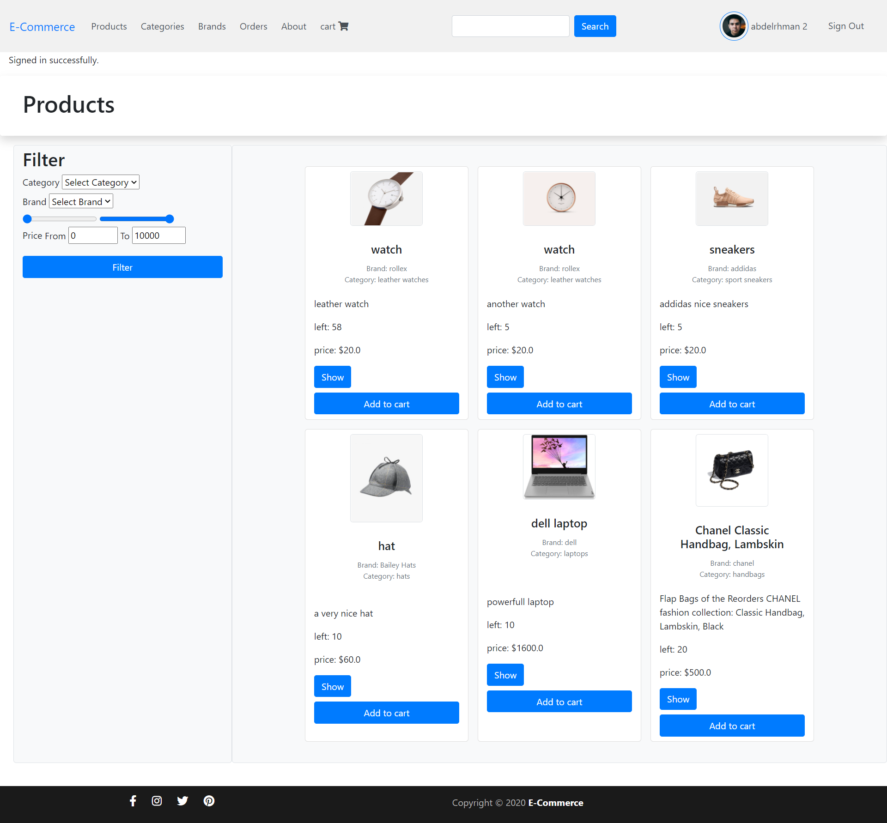
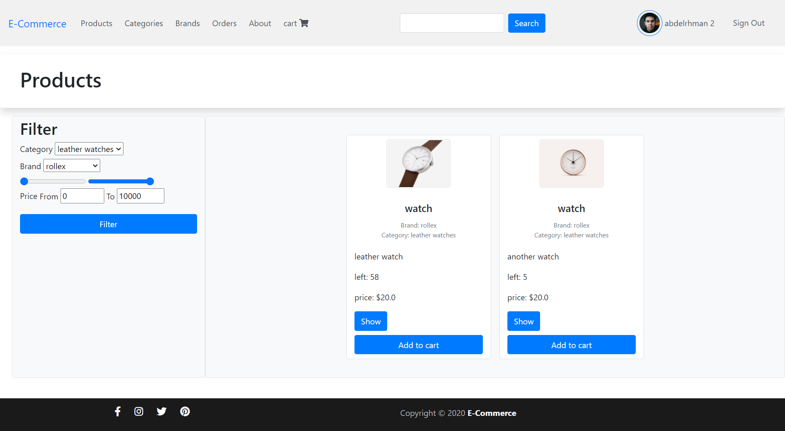
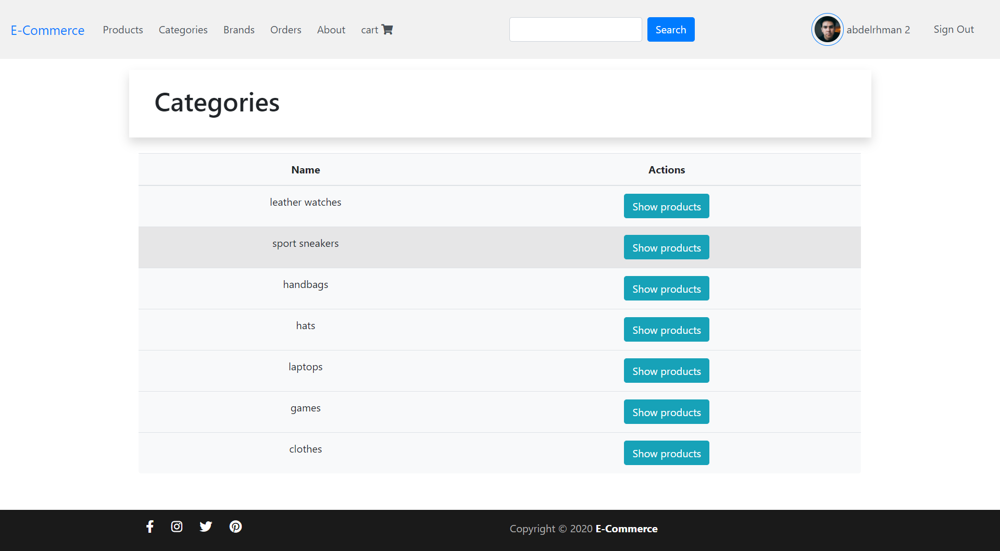
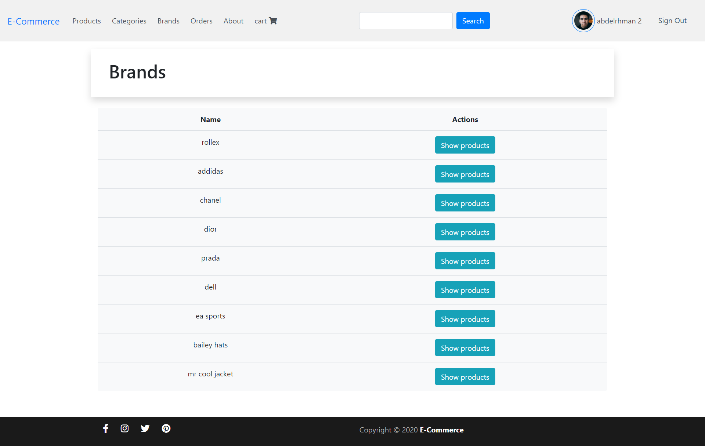
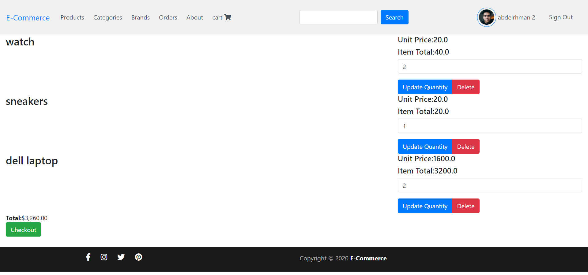

# E-commerce Rails Project Report 
## Table of content 

1. Introduction
 1. ERD diagram
 2. Design pattern
 3. Problems faced
 4. Installation
 5. Overview

### 1. Introduction
E-commerce Application to view products and through the freindly UI and browse products depending on categories and brands or even price with filtering, also seller can simply add products to his store, through the permission of admin to create the store for the seller, seller can accept the orders of the customers to confirm their purchase.
You can view the demo on: [https://rails-ecommerce-iti41.herokuapp.com/](https://rails-ecommerce-iti41.herokuapp.com/)

### 2. ERD diagram


### 3. Design Pattern

 - Used **Strategy Design Pattern**
	 - Advantages:
		 - Reduced the redundancy of the data
		 - Easily switch between models
		 - Can accept new models to be added
	 - Dis-advantages:
		 - No explicit foreign key

 - Used Observer design pattern
	 - Advantages:
		 - Create cart for registered users
	 - Dis-advantages:
		 - Adds overload to check for listeners 

 
### 4. Problems faced
- Multiple sellers in one order, if only one seller approved the whole order is approved although an order contains many products and different sellers and those sellers must approve their products too
- solution: adding approval status to the cart_order adapter

- Store controls products through seller user(owner) and also handle many orders in the same time with out having redundancy and many logic, and also the order is controlled by more than one store and one seller
- Solution: we used has_and_belong_to_many_relation ship

### 5. Installation
For installing E-commerce website.
1. You must first clone the current repository from the following command if you don't have git run the following command `sudo apt-get install git`
```git clone https://github.com/MalikHesham/E-Commerce-Platform-Rails.git``` 

2. Run bundle installer to install third party libraries
```bundle install``` 

3. Start migrating database files via this command this will install database then seed it with the required data to run the application.
```rails db:create```
```rails db:migrate```

4. To create system admin you can do one of the following commands 
```rails db:seed``` 

5. For starting the application run the following command 
```rails serve```

### 6. Overview

 - Home Page
  
-Products

- products search or filter
 
- browse categories
 
- browse brands
 
- cart
 
